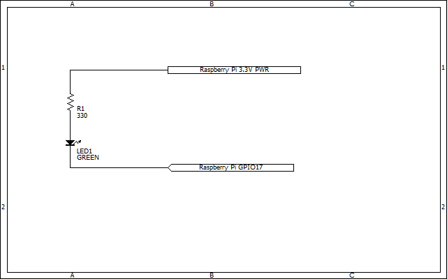

# gpio-web-server

## Description

The Python CGI Script to Control the LED.

## Demo

* [The Python CGI Script to Control the LED. - YouTube](https://www.youtube.com/watch?v=goIpO2GVTLs)

## Requirement for Raspberry Pi

### Hardware

* [Raspberry Pi](https://www.raspberrypi.com/products/raspberry-pi-3-model-b-plus/)
* LED and 330 ohm resistor

### Software

* [Raspberry Pi OS](https://www.raspberrypi.com/software/operating-systems/#raspberry-pi-os-32-bit)
* Python 3
* [Python Library: RPi.GPIO](https://pypi.org/project/RPi.GPIO/)

## Setup

### Hardware



### Software

```console
$ git clone https://github.com/KeitetsuWorks/raspi-gpio-web-server.git gpio-web-server
$ cd ./gpio-web-server/
$ pyenv virtualenv 3.7.7 py37-gpio # Optional
$ pyenv local py37-gpio # Optional
$ pip install -r requirements.txt
```

## Usage

1. Run the Python script

    ```console
    $ python gpio-web-server.py
    ```

1. Access the server with a web browser

    * `http://your_raspi_ip_address:5000/`

1. Press Ctrl + c on the terminal to exit

## 参考情報

### 公式ドキュメント

* [http.server --- HTTP サーバ — Python 3.10.4 ドキュメント](https://docs.python.org/ja/3/library/http.server.html)
* [cgi --- CGI (ゲートウェイインターフェース規格) のサポート — Python 3.10.4 ドキュメント](https://docs.python.org/ja/3/library/cgi.html?highlight=cgi%20fieldstorage)
  * バージョン 3.11 で非推奨: The cgi module is deprecated (see PEP 594 for details and alternatives).
  * [PEP 594 – Removing dead batteries from the standard library | peps.python.org](https://peps.python.org/pep-0594/#cgi)

## License

* MIT
